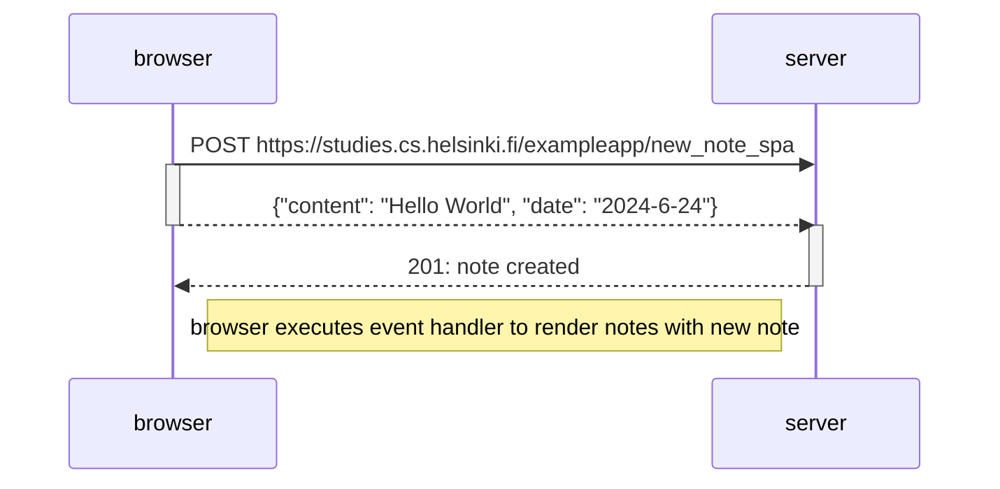

```mermaid
sequenceDiagram
    participant browser
    participant server

    browser->>server: POST https://studies.cs.helsinki.fi/exampleapp/new_note_spa
    activate browser
    browser-->>server: {"content": "Hello World", "date": "2024-6-24"}
    deactivate browser

    activate server
    server-->>browser: 201: note created
    deactivate server
    note right of browser: browser executes event handler to render notes with new note
```
